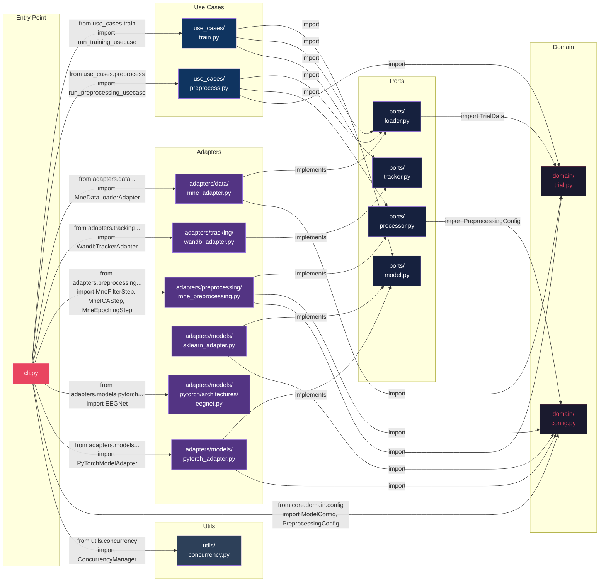
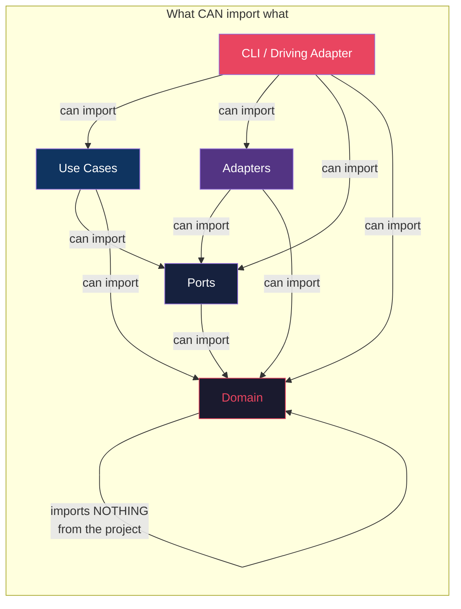
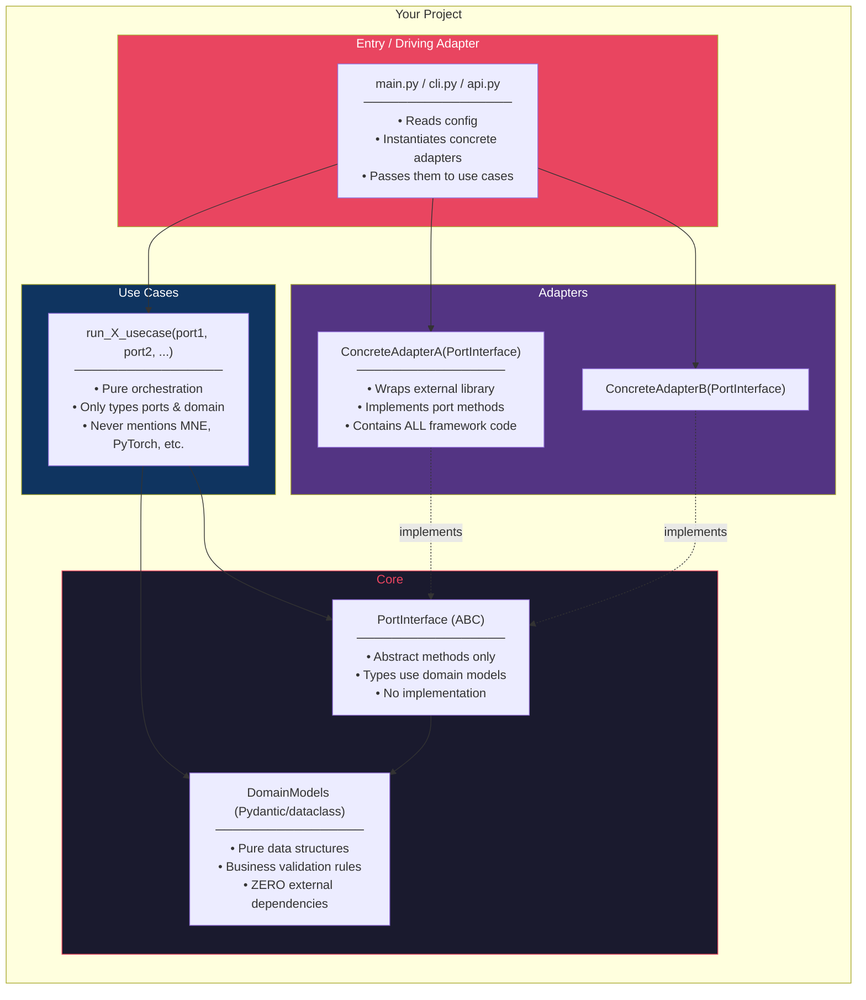

# UULMIC — Hexagonal Architecture Deep Dive

> **Goal**: Understand the Hexagonal (Ports & Adapters) architecture as implemented in this EEG research pipeline, and extract transferable patterns for any project.

---

## 1. The Big Picture — Hexagonal Ring Layout

The hexagonal architecture organizes code into concentric rings. **The Dependency Rule: imports always point inward** — adapters depend on ports, ports depend on domain, domain depends on nothing.

```mermaid
graph TB
    subgraph EXTERNAL["EXTERNAL WORLD"]
        direction TB
        MNE["MNE-Python<br/>(EEG Library)"]
        PyTorch["PyTorch<br/>(Deep Learning)"]
        Sklearn["Scikit-learn<br/>(Traditional ML)"]
        WandB["Weights & Biases<br/>(Experiment Tracking)"]
        Hydra["Hydra<br/>(Config Management)"]
        FS["File System<br/>(.set, .fif, .npy)"]
    end

    subgraph ADAPTERS["ADAPTERS (Infrastructure)"]
        direction TB
        MneLoader["MneDataLoaderAdapter"]
        MneFilter["MneFilterStep"]
        MneICA["MneICAStep"]
        MneEpoch["MneEpochingStep"]
        PyTorchAdapter["PyTorchModelAdapter"]
        SklearnAdapter["SklearnModelAdapter"]
        WandbAdapter["WandbTrackerAdapter"]
        EEGNet["EEGNet Architecture"]
    end

    subgraph PORTS["PORTS (Interfaces / Contracts)"]
        direction TB
        DataLoaderPort["DataLoaderPort<br/>⟨abstract⟩"]
        PreprocessingStepPort["PreprocessingStepPort<br/>⟨abstract⟩"]
        BaseModelPort["BaseModelPort<br/>⟨abstract⟩"]
        TrackerPort["TrackerPort<br/>⟨abstract⟩"]
    end

    subgraph CORE["CORE DOMAIN (Pure Business Logic)"]
        direction TB
        TrialData["TrialData"]
        TrialMetadata["TrialMetadata"]
        ModelConfig["ModelConfig"]
        PreprocessingConfig["PreprocessingConfig"]
    end

    subgraph USECASES["USE CASES (Application Logic)"]
        direction TB
        RunPreprocessing["run_preprocessing_usecase"]
        RunTraining["run_training_usecase"]
    end

    subgraph DRIVING["DRIVING ADAPTER (Entry Point)"]
        CLI["cli.py<br/>(Hydra CLI)"]
    end

    %% Driving adapter -> Use Cases
    CLI --> RunPreprocessing
    CLI --> RunTraining

    %% Use Cases -> Ports (inward dependency)
    RunPreprocessing --> DataLoaderPort
    RunPreprocessing --> PreprocessingStepPort
    RunTraining --> BaseModelPort
    RunTraining --> DataLoaderPort
    RunTraining --> TrackerPort

    %% Ports -> Domain (inward dependency)
    DataLoaderPort --> TrialData
    PreprocessingStepPort --> PreprocessingConfig
    BaseModelPort -.-> TrialData

    %% Adapters implement Ports
    MneLoader -.->|implements| DataLoaderPort
    MneFilter -.->|implements| PreprocessingStepPort
    MneICA -.->|implements| PreprocessingStepPort
    MneEpoch -.->|implements| PreprocessingStepPort
    PyTorchAdapter -.->|implements| BaseModelPort
    SklearnAdapter -.->|implements| BaseModelPort
    WandbAdapter -.->|implements| TrackerPort

    %% Adapters -> External libs
    MneLoader --- MNE
    MneLoader --- FS
    MneFilter --- MNE
    MneICA --- MNE
    MneEpoch --- MNE
    PyTorchAdapter --- PyTorch
    SklearnAdapter --- Sklearn
    WandbAdapter --- WandB
    CLI --- Hydra
    EEGNet --- PyTorch

    %% Styling
    style CORE fill:#1a1a2e,stroke:#e94560,stroke-width:3px,color:#fff
    style PORTS fill:#16213e,stroke:#0f3460,stroke-width:2px,color:#fff
    style USECASES fill:#0f3460,stroke:#533483,stroke-width:2px,color:#fff
    style ADAPTERS fill:#533483,stroke:#e94560,stroke-width:2px,color:#fff
    style EXTERNAL fill:#2d2d2d,stroke:#666,stroke-width:1px,color:#ccc
    style DRIVING fill:#e94560,stroke:#fff,stroke-width:2px,color:#fff
```



---

## 2. File Tree with Roles

```
UULMIC/
├── main.py                          # System check (not the real entry point)
├── configs/
│   ├── default.yaml                 # Hydra root config
│   ├── model/
│   │   ├── eegnet.yaml              # EEGNet hyperparameters
│   │   └── nfeeg.yaml               # NFEEGNet hyperparameters
│   └── preprocessing/               # Preprocessing config overrides
│
└── src/
    ├── cli.py                       # DRIVING ADAPTER — Hydra entry point, wires everything
    │
    ├── core/                        # INNER HEXAGON — zero external dependencies
    │   ├── domain/                  #    Pure data models (Pydantic)
    │   │   ├── config.py            #    ModelConfig, PreprocessingConfig
    │   │   ├── trial.py             #    TrialData, TrialMetadata
    │   │   └── data.py              #    (Legacy duplicate — same models)
    │   └── ports/                   #    Abstract interfaces (ABC)
    │       ├── loader.py            #    DataLoaderPort
    │       ├── model.py             #    BaseModelPort
    │       ├── processor.py         #    PreprocessingStepPort
    │       └── tracker.py           #    TrackerPort
    │
    ├── use_cases/                   # APPLICATION LOGIC — orchestrates ports
    │   ├── preprocess.py            #    run_preprocessing_usecase()
    │   └── train.py                 #    run_training_usecase()
    │
    ├── adapters/                    # OUTER HEXAGON — concrete implementations
    │   ├── data/
    │   │   └── mne_adapter.py       #    MneDataLoaderAdapter → implements DataLoaderPort
    │   ├── preprocessing/
    │   │   └── mne_preprocessing.py #    MneFilterStep, MneICAStep, MneEpochingStep → PreprocessingStepPort
    │   ├── models/
    │   │   ├── pytorch_adapter.py   #    PyTorchModelAdapter → implements BaseModelPort
    │   │   ├── sklearn_adapter.py   #    SklearnModelAdapter → implements BaseModelPort
    │   │   └── pytorch/
    │   │       └── architectures/
    │   │           ├── eegnet.py    #    EEGNet (nn.Module) — pure PyTorch
    │   │           ├── nfeeg.py     #    NFEEGNet architecture
    │   │           └── fbcnet.py    #    FBCNet architecture
    │   └── tracking/
    │       └── wandb_adapter.py     #    WandbTrackerAdapter → implements TrackerPort
    │
    └── utils/
        └── concurrency.py           #    ConcurrencyManager — hardware-aware threading
```

---

## 3. Complete Import Dependency Graph

This shows **every `import` relationship** between project files. Notice how arrows always point inward (towards `core/`). No core file ever imports from adapters.



---

## 4. Port → Adapter Mapping Table

| Port (Interface) | Method Signatures | Concrete Adapter(s) | External Library |
|---|---|---|---|
| **DataLoaderPort** | `load_training_data(data_dir) → TrialData`<br/>`load_raw_subject(vp_id) → Any` | `MneDataLoaderAdapter` | MNE-Python |
| **PreprocessingStepPort** | `process(data: Any) → Any` | `MneFilterStep`<br/>`MneICAStep`<br/>`MneResampleStep`<br/>`MneEpochingStep` | MNE-Python |
| **BaseModelPort** | `fit(X, y) → None`<br/>`predict(X) → ndarray`<br/>`evaluate(X, y) → Dict`<br/>`get_params() → Dict` | `PyTorchModelAdapter`<br/>`SklearnModelAdapter` | PyTorch / Sklearn |
| **TrackerPort** | `log_params(params)`<br/>`log_metrics(metrics, step)`<br/>`finish()` | `WandbTrackerAdapter` | Weights & Biases |

> [!IMPORTANT]
> **The Swap Principle**: To switch from MNE to BrainFlow, you only create `BrainFlowDataLoaderAdapter(DataLoaderPort)` — zero changes to use cases, domain, or any other adapter.

---

## 5. Data Flow — Preprocessing Pipeline

```mermaid
flowchart LR
    subgraph "Entry"
        A["cli.py<br/>mode='preprocess'"]
    end
    
    subgraph "Wiring"
        B["Create PreprocessingConfig<br/>from Hydra YAML"]
        C["Instantiate Steps:<br/>MneFilterStep<br/>MneICAStep<br/>MneEpochingStep"]
    end
    
    subgraph "Use Case"
        D["run_preprocessing_usecase()<br/>ThreadPoolExecutor"]
    end
    
    subgraph "Per Subject (parallel)"
        E["loader.load_raw_subject(vp_id)<br/>→ mne.io.Raw"]
        F["MneFilterStep.process(raw)<br/>→ mne.io.Raw (filtered)"]
        G["MneICAStep.process(raw)<br/>→ mne.io.Raw (cleaned)"]
        H["MneEpochingStep.process(raw)<br/>→ TrialData(X, y, metadata)"]
        I["Save .npy + .json"]
    end
    
    A --> B --> C --> D
    D --> E --> F --> G --> H --> I
    
    style A fill:#e94560,color:#fff
    style B fill:#533483,color:#fff
    style C fill:#533483,color:#fff
    style D fill:#0f3460,color:#fff
    style E fill:#16213e,color:#fff
    style F fill:#16213e,color:#fff
    style G fill:#16213e,color:#fff
    style H fill:#1a1a2e,color:#e94560,stroke:#e94560
    style I fill:#2d4059,color:#fff
```



---

## 6. Data Flow — Training Pipeline

```mermaid
flowchart LR
    subgraph "Entry"
        A["cli.py<br/>mode='train'"]
    end
    
    subgraph "Wiring"
        B["Create ModelConfig<br/>from Hydra YAML"]
        C["Instantiate:<br/>EEGNet(config)<br/>PyTorchModelAdapter(model)<br/>WandbTrackerAdapter()"]
    end
    
    subgraph "Use Case"
        D["run_training_usecase()"]
    end
    
    subgraph "Execution"
        E["loader.load_training_data(dir)<br/>→ TrialData"]
        F["tracker.log_params(...)"]
        G["model.fit(X, y)<br/>(PyTorch training loop)"]
        H["model.evaluate(X, y)<br/>→ {'accuracy': 0.85}"]
        I["tracker.log_metrics(metrics)"]
        J["tracker.finish()"]
    end
    
    A --> B --> C --> D
    D --> E --> F --> G --> H --> I --> J
    
    style A fill:#e94560,color:#fff
    style B fill:#533483,color:#fff
    style C fill:#533483,color:#fff
    style D fill:#0f3460,color:#fff
    style E fill:#16213e,color:#fff
    style F fill:#16213e,color:#fff
    style G fill:#16213e,color:#fff
    style H fill:#16213e,color:#fff
    style I fill:#16213e,color:#fff
    style J fill:#16213e,color:#fff
```



---

## 7. The Dependency Rule — Visualized

This is the **single most important rule** of hexagonal architecture. Violations of this rule (e.g., a domain model importing `torch`) break the entire pattern.



> [!CAUTION]
> **Violation detected**: [data.py](file:///home/z/Projects/AntigravityProjects/UULMIC/src/core/domain/data.py) line 1 imports `from torch._inductor.cudagraph_trees import OutputList` — this is a framework dependency _inside_ the core domain, which breaks the hexagonal rule. The domain should only use standard library + Pydantic.

---

## 8. Transferable Template — Apply to ANY Project



### Recipe for a New Hexagonal Project

| Step | What to Do | UULMIC Example |
|------|-----------|---------------|
| **1. Define Domain** | Create pure data models with zero framework imports | `TrialData`, `TrialMetadata`, `ModelConfig`, `PreprocessingConfig` |
| **2. Define Ports** | Write abstract base classes with method signatures typed using domain models | `DataLoaderPort`, `BaseModelPort`, `PreprocessingStepPort`, `TrackerPort` |
| **3. Write Use Cases** | Orchestration functions that accept ports as parameters, never concrete types | `run_training_usecase(model: BaseModelPort, loader: DataLoaderPort, ...)` |
| **4. Implement Adapters** | Concrete classes that inherit from ports and wrap external libraries | `MneDataLoaderAdapter(DataLoaderPort)`, `PyTorchModelAdapter(BaseModelPort)` |
| **5. Wire in Entry Point** | The ONLY place where concrete adapters are instantiated and injected | `cli.py` creates `MneDataLoaderAdapter` and passes to `run_training_usecase()` |

> [!TIP]
> **The Litmus Test**: Can you delete an entire adapter folder and the project still compiles (minus the entry point wiring)? If yes, your hexagonal architecture is correct. In UULMIC, deleting `adapters/tracking/wandb_adapter.py` would only require updating `cli.py` — no use case or domain code changes.

---

## 9. Key Design Decisions in UULMIC

| Decision | Rationale |
|---|---|
| **Ports as ABCs** (not Protocols) | Explicit inheritance makes it clear which adapters implement which contracts |
| **Pydantic for Domain models** | Runtime validation + serialization for free, JSON metadata export |
| **Hydra for Configuration** | Hierarchical YAML configs with command-line overrides, model config composition |
| **Wiring in CLI only** | All `if model_name == "eegnet"` logic is confined to the driving adapter |
| **ThreadPoolExecutor for preprocessing** | Leverages Python 3.14's free-threaded mode for true parallelism |
| **PreprocessingStepPort as pipeline** | Steps are composable; add/remove/reorder without changing the use case |
